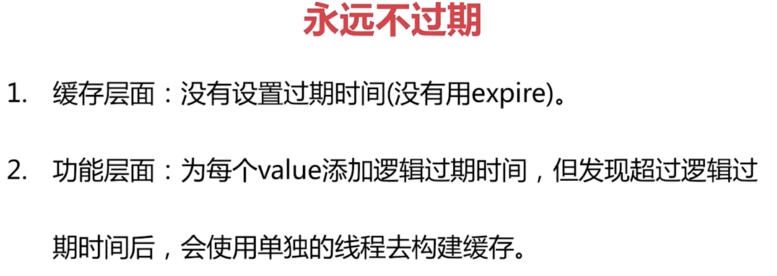

##redis作为缓存的应用
**优点：**
1、加速读写
2、降低后端负载
**成本：**
1、数据不一致问题
2、代码维护成本，多了一层缓存逻辑
3、运维成本
**使用场景：**
1、降低后端负载：对高消耗的sql进行结果缓存
2、加速请求响应
3、大量写合并为批量写

###缓存更新策略：
1、LRU/LFU/FIFO算法剔除：例如maxmemory-policy
2、超时剔除：例如expire
3、主动更新：开发控制生命周期

###缓存穿透问题

###缓存雪崩问题

###热点key重建优化

 

##基于redis的分布式布隆过滤器
1、引出布隆过滤器

2、布隆过滤器的原理

