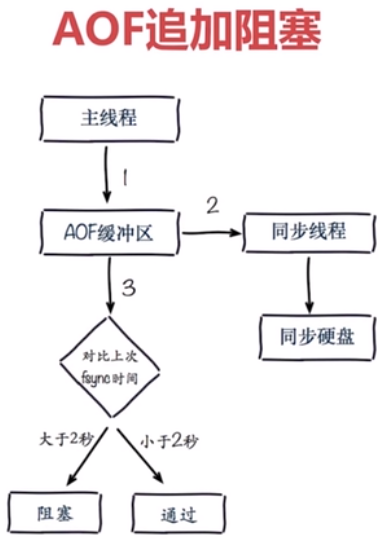

##redis特性：
 * 1、速度快 10wOPS c语言开发 单线程 数据存储在内存中
 * 2、持久化 RDB AOF
 * 3、多种数据结构 Strings、Hash Tables、Linked Lists、sets、sorted sets、BitMaps、HyperLogLog（用12k内存进行唯一值计数）、GEO（地址信息定位）
 * 4、支持多种客户端语言
 * 5、功能丰富：发布订阅、Lua脚本（原子执行）、事物、pipeline
 * 6、简单：核心代码少（23k），单线程模型
 * 7、主从复制
 * 8、高可用以及分布式 sentinel 、 cluster

##redis典型应用场景
  缓存、计数、消息队列、排行榜、社交网络、实时系统

##配置
  获取配置：config get *
  过滤配置文件中的注释和空行去掉：cat redis-6380.conf | grep -v "#" | grep -v "^$" > redis-6380-sim.conf

##通用命令：
 * 1、keys *、 keys a*、 keys a[a-z]* (keys一般不要在生产环境中使用，可以在热备从节点使用，也可以用scan命令代替)
 * 2、dbsize（计算key的总数）
 * 3、exists（key是否存在）
 * 4、del(删除key)
 * 5、expire key seconds（在多少秒后过期） ttl key（查看剩余过期时间） persist key（取消过期，持久化）
 * 6、type key（返回key的类型）

##数据结构

##单线程
为什么单线程这么快？
 * 纯内存
 * 非阻塞IO：epoll模型
 * 避免了线程切换以及竞争带来的性能消耗
注意事项：
 * 一次只运行一条命令
 * 拒绝执行长命令（会阻塞后面的操作）
 * 其实不是单线程（有独立的线程进行持久化操作）

##String类型

incr key
incrbyfloat key value
getrange key begin end
strlen key

##Hash类型
key:{field:value}
Mapmap类型

ttl不能针对key中的某个属性

##List类型
本质上是一个有序链表linkedlist
lpush、lpop、rpush、rpop
linsert key before|after value newvalue

ltrim后list的下标索引会重新计算

##Set类型

sadd 可以给用户添加标签
spop/srandmember 可以进行抽奖
sadd + sinner 可以做社交 比如共同关注的人等等

##zset类型
zadd key score element
zrem key element
zscore key element
zincreby key incrScore element
zcard key //计算个数

##慢查询

##pipeline

##bitmap

##hyperLogLog

##geo

##redis持久化
###RDB快照模式

触发RDB的三种方式：
1、执行save命令，这个命令是同步的，会阻塞redis
2、执行bgsave命令，这个命令是异步执行的，不会阻塞redis

3、自动生成RDB

自动生成配置不当会导致频繁写入RDB文件

###AOF日志模式

AOF的三种策略
1、always:每条命令都写入AOF文件中

2、everysec(默认策略):每秒将缓冲区的数据写入AOF文件中

3、no:由操作系统决定什么时候写入AOF文件中

AOF重写：将重复的，过期的，覆盖的数据都过滤掉，以实现减少硬盘占用量和加快恢复速度的作用

AOF重写触发的两种方式：
1、bgrewriteaof命令（不是读取aof文件进行重写，而是读取redis在内存中的记录进行重写）
2、AOF重写配置：auto-aof-rewrite-min-size(尺寸)、auto-aof-rewrite-percentage(增长率)

AOF配置

###RDB和AOF的对比

RDB最佳策略：
建议关闭RDB，如果是主从模式，主关，从开（但由于redis基本都是单机部署多个redis实例，所以也不能让从机频繁进行RDB）

AOF最佳策略：
建议开启AOF，everysec策略，最多只丢一秒的数据

**注意：fork函数是一个系统级别的函数，这个函数的作用就是复制当前进程的一个子进程，这对于主进程来说本身就是一个同步的操作，
是会阻塞redis的，它的耗时时间与当前redis占用的内存量息息相关，内存占用越大，耗时越长。**

##redis sentinel

raft算法

**sentinel总结**

## redis cluster

redis cluster的特点：主从复制，分片，高可用

### 数据分布

1、节点取余分区

节点伸缩会导致数据迁移，翻倍扩容可以减少迁移量至50%

2、一致性哈希分区

3、虚拟槽分区（redis使用的分区方式）

**原生命令安装搭建集群：**

1）配置开启节点：cluster-enabled yes、cluster-config-file node-${port}.conf

需要6个节点，3主3备

2）meet：命令cluster meet ip port，例如redis-cli -h 127.0.0.1 -p 7000 cluster meet 127.0.0.1 7001

3）指派槽

4）主从

**官方工具安装搭建集群：**

**集群伸缩：**
原理：槽和数据在节点间的移动

集群扩容：
1、准备新的节点

2、加入集群

3、迁移槽和数据
redis-trib.rb 的 reshard命令

集群收缩：
1、下线迁移槽
redis-trib.rb 的 reshard命令

2、忘记节点
cluster forget ${downNodeId}
redis-trib.rb 的 del-node命令

3、关闭节点

**redis客户端路由**
1、moved重定向异常：
redis-cli如果没有加-c参数就不是集群模式登录，如果没有直接命中槽将会出现moved异常，该异常会告知该key所在的目标节点的ip、端口及槽号
加入-c参数就会自动跳转至目标节点。

2、ask重定向异常：
槽正在被迁移过程中时访问key

3、smart客户端（JedisCluster）：

