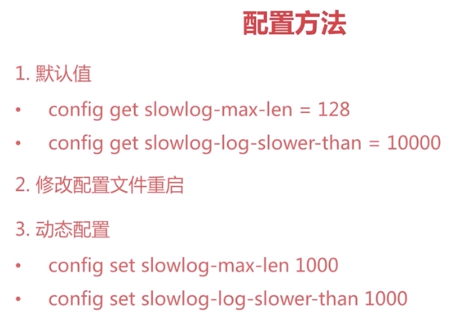

##redis特性：
 * 1、速度快 10wOPS c语言开发 单线程 数据存储在内存中
 * 2、持久化 RDB AOF
 * 3、多种数据结构 Strings、Hash Tables、Linked Lists、sets、sorted sets、BitMaps、HyperLogLog（用12k内存进行唯一值计数）、GEO（地址信息定位）
 * 4、支持多种客户端语言
 * 5、功能丰富：发布订阅、Lua脚本（原子执行）、事物、pipeline
 * 6、简单：核心代码少（23k），单线程模型
 * 7、主从复制
 * 8、高可用以及分布式 sentinel 、 cluster
 
##redis典型应用场景
  缓存、计数、消息队列、排行榜、社交网络、实时系统

##配置
  获取配置：config get *
  过滤配置文件中的注释和空行去掉：cat redis-6380.conf | grep -v "#" | grep -v "^$" > redis-6380-sim.conf

##通用命令：
 * 1、keys *、 keys a*、 keys a[a-z]* (keys一般不要在生产环境中使用，可以在热备从节点使用，也可以用scan命令代替)
 * 2、dbsize（计算key的总数）
 * 3、exists（key是否存在）
 * 4、del(删除key)
 * 5、expire key seconds（在多少秒后过期） ttl key（查看剩余过期时间） persist key（取消过期，持久化）
 * 6、type key（返回key的类型）
 
##数据结构

##单线程
为什么单线程这么快？
 * 纯内存
 * 非阻塞IO：epoll模型
 * 避免了线程切换以及竞争带来的性能消耗
注意事项：
 * 一次只运行一条命令
 * 拒绝执行长命令（会阻塞后面的操作）
 * 其实不是单线程（有独立的线程进行持久化操作）
 
##String类型

incr key
incrbyfloat key value
getrange key begin end
strlen key

##Hash类型
key:{field:value}
Mapmap类型

ttl不能针对key中的某个属性

##List类型
本质上是一个有序链表linkedlist
lpush、lpop、rpush、rpop
linsert key before|after value newvalue

ltrim后list的下标索引会重新计算

##Set类型

sadd 可以给用户添加标签
spop/srandmember 可以进行抽奖
sadd + sinner 可以做社交 比如共同关注的人等等

##zset类型
zadd key score element
zrem key element
zscore key element
zincreby key incrScore element
zcard key //计算个数

##慢查询

